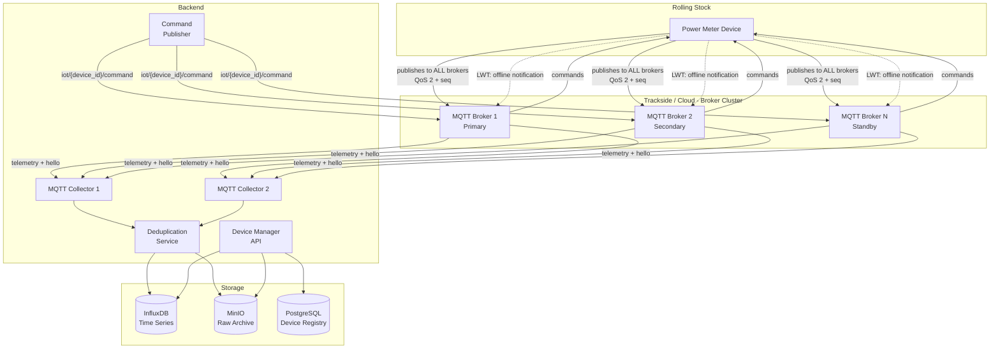
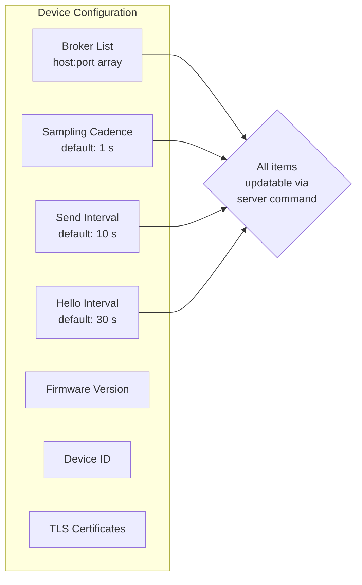
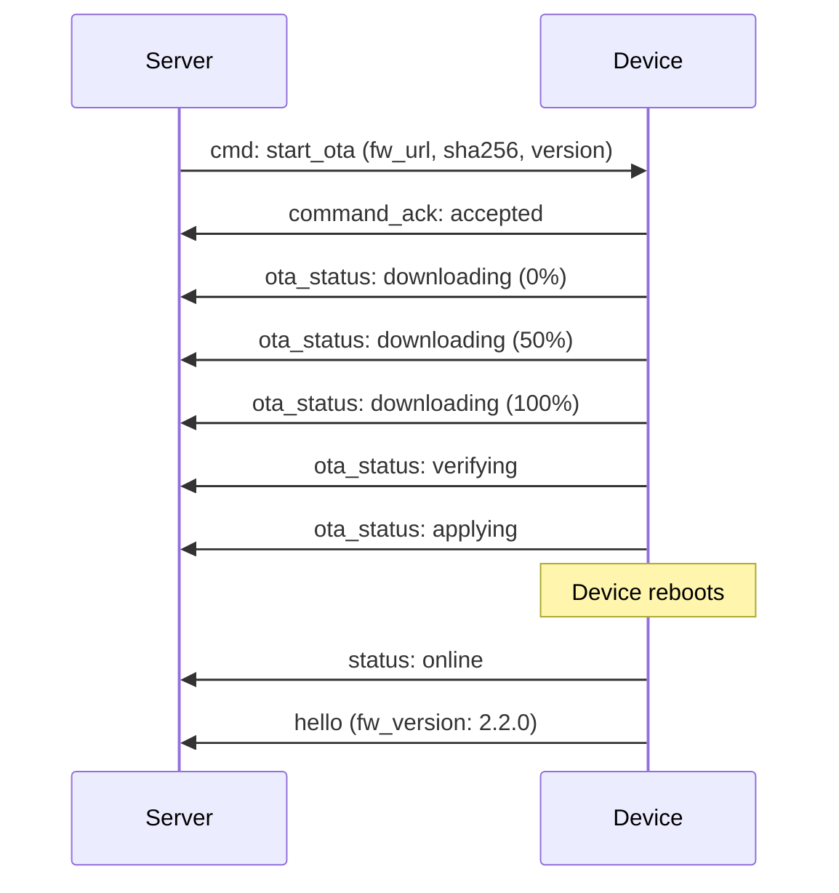

# IoT Meter — Device Firmware Requirements Specification

> **Document ID:** IOT-METER-REQ-001  
> **Version:** 2.0  
> **Status:** Active  
> **Last Updated:** 2026-02-12  
> **Audience:** Device firmware engineering team  
> **Change policy:** Any change to this document MUST be reflected in the test suite (`tests/`) and vice-versa.

---

## 1. Scope & Context

IoT Meter is a telemetry platform for **high-voltage power metering** in the **rail mobility industry** (mainline rail, metro, tram, light-rail). Devices are installed on the **main power line** of rolling stock and measure DC traction voltage / current (and AC where the infrastructure uses it).

### 1.1 Target Voltage Systems

| System | Nominal Voltage | Typical Use |
|--------|----------------|-------------|
| DC 750 V | 500–900 V | Metro, light-rail, tram |
| DC 1500 V | 1000–1800 V | Suburban rail, metro |
| DC 3000 V | 2200–3600 V | Mainline rail (e.g. Belgium, Italy, Spain) |
| AC 15 kV 16.7 Hz | 12–17.5 kV | Mainline rail (Germany, Austria, Switzerland) |
| AC 25 kV 50 Hz | 17.5–29 kV | Mainline rail (France, UK, China, high-speed) |

### 1.2 Standards Compliance

| Standard | Applicability |
|----------|---------------|
| **EN 50463** | Energy measurement on railway vehicles |
| **IEC 61000-4-30** | Power quality measurement methods |
| **IEC 62053-21/22/23** | Active, apparent, reactive energy metering |
| **IEC 61557-12** | Power metering and monitoring devices |
| **EN 50155** | Electronic equipment on rolling stock |
| **EN 45545-2** | Fire protection for railway vehicles (enclosure) |

---

## 2. System Architecture

### 2.1 Architecture Diagram



### 2.2 Resilience Model

| Requirement | Implementation |
|-------------|----------------|
| **Zero message loss** | Devices publish to **all** configured MQTT brokers simultaneously. QoS 2 (exactly-once) per broker. |
| **Broker failure tolerance** | Device maintains independent connections to ≥ 2 brokers. If one broker goes down the device continues publishing to the others. |
| **Backend deduplication** | Every message carries a monotonic `seq` (sequence number). The deduplication service drops duplicates keyed on `(device_id, seq)`. |
| **Gap detection** | Backend monitors `seq` continuity per device. A gap triggers an alert. |
| **Offline detection** | MQTT Last Will and Testament (LWT) + hello message timeout (see §5). |
| **Configurable broker list** | The list of broker endpoints is part of the device configuration and can be updated via server command (see §6). |

### 2.3 Configuration Baseline



---

## 3. MQTT Topics

### 3.1 Topic Map

| Topic | Direction | QoS | Purpose |
|-------|-----------|-----|---------|
| `iot/{device_id}/telemetry` | Device → Server | 2 | Measurement datagrams |
| `iot/{device_id}/hello` | Device → Server | 2 | Heartbeat / hello messages |
| `iot/{device_id}/status` | Device → Server (LWT) | 1 | Online/offline notification |
| `iot/{device_id}/command` | Server → Device | 2 | Configuration commands |
| `iot/{device_id}/command/ack` | Device → Server | 2 | Command acknowledgement |
| `iot/{device_id}/ota/status` | Device → Server | 1 | OTA upgrade progress |

### 3.2 QoS Rationale

**QoS 2 (exactly-once)** is mandatory for telemetry and commands. The 4-packet handshake is acceptable because:

- Devices are **mains-powered** (traction line), not battery constrained.
- Network links (cellular/Wi-Fi/Ethernet on rolling stock) support the overhead.
- The cost of lost or duplicated power metering data exceeds the cost of extra MQTT packets.

### 3.3 MQTT Session

| Parameter | Value |
|-----------|-------|
| Clean session | `false` (persistent session) |
| Keep-alive | 15 s |
| Session expiry | 3600 s (1 hour) — broker retains undelivered QoS 2 messages while device reconnects |

### 3.4 Last Will and Testament (LWT)

Every device MUST register an LWT on connect:

```
Topic:   iot/{device_id}/status
Payload: {"v":2,"device_id":"{device_id}","status":"offline","ts":"..."}
QoS:     1
Retain:  true
```

On successful connect the device MUST immediately publish:

```json
{"v": 2, "device_id": "dc-meter-007", "status": "online", "ts": "2026-02-12T10:00:00Z"}
```

to the same topic with `retain: true`.

---

## 4. Payload Format — Version 2 (v2)

### 4.1 Common Envelope

Every message (telemetry, hello, command, ack) shares a common envelope:

| Field | Type | Required | Description |
|-------|------|----------|-------------|
| `v` | `integer` | **Yes** | Payload version. `2` for this spec. |
| `device_id` | `string` | **Yes** | Unique device identifier. Must match authenticated identity. |
| `ts` | `string` (ISO 8601) | **Yes** | UTC timestamp of message creation. |
| `seq` | `integer` | **Yes** | Monotonic sequence number. Starts at 0 on power-on, increments by 1 for every published message (across all message types). Wraps at $2^{32} - 1$. |
| `msg_type` | `string` | **Yes** | One of: `telemetry`, `hello`, `status`, `command_ack`, `ota_status`. |

### 4.2 Telemetry Datagram

Published to `iot/{device_id}/telemetry`. Contains one sampling window of measurements.

```json
{
  "v": 2,
  "device_id": "dc-meter-007",
  "ts": "2026-02-12T10:00:10Z",
  "seq": 142,
  "msg_type": "telemetry",
  "measurements": [
    { "ts": "2026-02-12T10:00:01Z", "type": "voltage_dc", "val": 756.3, "unit": "V" },
    { "ts": "2026-02-12T10:00:01Z", "type": "current_dc", "val": 312.8, "unit": "A" },
    { "ts": "2026-02-12T10:00:02Z", "type": "voltage_dc", "val": 754.1, "unit": "V" },
    { "ts": "2026-02-12T10:00:02Z", "type": "current_dc", "val": 315.2, "unit": "A" },
    { "ts": "2026-02-12T10:00:03Z", "type": "voltage_dc", "val": 758.9, "unit": "V" },
    { "ts": "2026-02-12T10:00:03Z", "type": "current_dc", "val": 310.1, "unit": "A" }
  ]
}
```

#### Sampling & Sending Cadence

| Parameter | Default | Configurable | Description |
|-----------|---------|--------------|-------------|
| **Sampling cadence** | 1 s | Yes, via command | How often the device reads V, I from sensors. |
| **Send interval** | 10 s | Yes, via command | How often the device publishes a datagram. Device buffers readings and sends them as a batch. |
| **Max measurements per datagram** | 200 | No | Hard limit to keep payloads under broker max. |

At default settings: 1 s sampling × 10 s send interval = 10 V/I pairs per datagram = 20 measurement objects.

### 4.3 Hello Message

Published to `iot/{device_id}/hello`.

```json
{
  "v": 2,
  "device_id": "dc-meter-007",
  "ts": "2026-02-12T10:00:30Z",
  "seq": 145,
  "msg_type": "hello",
  "fw_version": "2.1.0",
  "uptime_s": 86400,
  "broker_connections": 2,
  "buf_usage_pct": 12,
  "temp_internal": 42.3
}
```

#### Hello Message Fields

| Field | Type | Required | Description |
|-------|------|----------|-------------|
| `fw_version` | `string` | **Yes** | Current firmware version (semver). |
| `uptime_s` | `integer` | **Yes** | Seconds since last power-on. |
| `broker_connections` | `integer` | **Yes** | Number of MQTT brokers currently connected. |
| `buf_usage_pct` | `integer` | **Yes** | Local message buffer usage (0–100%). |
| `temp_internal` | `number` | No | Internal board temperature (°C). |

#### REQ-HELLO-001: Hello / Datagram Frequency Rule

> **If the datagram send interval ≤ hello interval, then datagrams serve as implicit heartbeats and explicit hello messages MUST NOT be sent.**  
> **If the datagram send interval > hello interval, the device MUST send explicit hello messages at the configured hello interval.**

| Datagram interval | Hello interval | Behaviour |
|-------------------|---------------|-----------|
| 10 s | 30 s | Hello suppressed — datagrams arrive every 10 s, which is more frequent. |
| 60 s | 30 s | Hello sent every 30 s between datagrams. |
| 10 s | 10 s | Hello suppressed — datagram cadence matches. |

Backend uses `max(datagram_interval, hello_interval)` as the liveness timeout. If no message (of any type) is received within `2 × timeout`, the device is marked **offline**.

### 4.4 Status Message

Published to `iot/{device_id}/status` (also used by LWT).

```json
{
  "v": 2,
  "device_id": "dc-meter-007",
  "ts": "2026-02-12T10:00:00Z",
  "status": "online"
}
```

| `status` value | Meaning |
|----------------|---------|
| `online` | Device just connected. Published by device on connect. |
| `offline` | Device lost connection. Published by broker (LWT). |

---

## 5. Device Online / Offline Detection

The backend uses **three complementary mechanisms**:

| # | Mechanism | Latency | Covers |
|---|-----------|---------|--------|
| 1 | **LWT** on MQTT disconnect | Seconds | Unclean disconnects (network loss, crash) |
| 2 | **Retained `status` topic** | Instant on subscribe | Current state query |
| 3 | **Hello / datagram timeout** | 2 × max(send_interval, hello_interval) | Clean connects with no data flow |

### REQ-ONLINE-001: Backend Liveness Logic

```
timeout = 2 × max(send_interval, hello_interval)
if now() - last_message_ts > timeout:
    mark device OFFLINE
    raise alert
```

The `last_message_ts` is updated on receipt of ANY message type (telemetry, hello, command_ack).

---

## 6. Server → Device Commands

The server publishes commands to `iot/{device_id}/command`. The device subscribes to this topic with QoS 2.

### 6.1 Command Envelope

```json
{
  "v": 2,
  "cmd_id": "a3f7c2e1-9b4d-4e8a-b6f1-2d3e4f5a6b7c",
  "ts": "2026-02-12T10:05:00Z",
  "cmd": "update_config",
  "params": { }
}
```

| Field | Type | Required | Description |
|-------|------|----------|-------------|
| `v` | `integer` | **Yes** | Payload version. |
| `cmd_id` | `string` (UUID) | **Yes** | Unique command identifier for tracking. |
| `ts` | `string` | **Yes** | Server timestamp when command was issued. |
| `cmd` | `string` | **Yes** | Command type (see §6.2). |
| `params` | `object` | **Yes** | Command-specific parameters. |

### 6.2 Command Types

| Command | `cmd` value | Description |
|---------|-------------|-------------|
| Update configuration | `update_config` | Change sampling cadence, send interval, hello interval, broker list. |
| Start OTA | `start_ota` | Trigger firmware download and upgrade. |
| Reboot | `reboot` | Schedule device reboot. |
| Factory reset | `factory_reset` | Restore device to factory defaults. |
| Request status | `request_status` | Device must reply with a hello message immediately. |

### 6.3 `update_config` Command

```json
{
  "v": 2,
  "cmd_id": "a3f7c2e1-9b4d-4e8a-b6f1-2d3e4f5a6b7c",
  "ts": "2026-02-12T10:05:00Z",
  "cmd": "update_config",
  "params": {
    "sampling_cadence_ms": 1000,
    "send_interval_s": 10,
    "hello_interval_s": 30,
    "brokers": [
      { "host": "broker1.example.com", "port": 8883 },
      { "host": "broker2.example.com", "port": 8883 }
    ]
  }
}
```

Any parameter may be omitted — device keeps the current value for omitted fields.

### 6.4 `start_ota` Command

```json
{
  "v": 2,
  "cmd_id": "b4e8f1a2-3c5d-6e7f-8a9b-0c1d2e3f4a5b",
  "ts": "2026-02-12T11:00:00Z",
  "cmd": "start_ota",
  "params": {
    "fw_version": "2.2.0",
    "fw_url": "https://ota.example.com/firmware/dc-meter/2.2.0.bin",
    "fw_sha256": "e3b0c44298fc1c149afbf4c8996fb92427ae41e4649b934ca495991b7852b855",
    "fw_size_bytes": 524288
  }
}
```

### 6.5 Command Acknowledgement

Device publishes to `iot/{device_id}/command/ack`:

```json
{
  "v": 2,
  "device_id": "dc-meter-007",
  "ts": "2026-02-12T10:05:01Z",
  "seq": 150,
  "msg_type": "command_ack",
  "cmd_id": "a3f7c2e1-9b4d-4e8a-b6f1-2d3e4f5a6b7c",
  "result": "accepted",
  "detail": "Config updated. New send_interval_s=15."
}
```

| `result` value | Meaning |
|----------------|---------|
| `accepted` | Command was applied successfully. |
| `rejected` | Command was understood but rejected (with `detail` reason). |
| `error` | Command processing failed (with `detail`). |
| `unsupported` | Command type not recognized by this firmware version. |

---

## 7. OTA Firmware Upgrade

### 7.1 OTA Flow



### 7.2 OTA Status Message

Published to `iot/{device_id}/ota/status`:

```json
{
  "v": 2,
  "device_id": "dc-meter-007",
  "ts": "2026-02-12T11:00:30Z",
  "seq": 200,
  "msg_type": "ota_status",
  "cmd_id": "b4e8f1a2-3c5d-6e7f-8a9b-0c1d2e3f4a5b",
  "ota_state": "downloading",
  "progress_pct": 50,
  "fw_version_target": "2.2.0"
}
```

| `ota_state` | Description |
|-------------|-------------|
| `downloading` | Firmware download in progress. `progress_pct` updated periodically. |
| `verifying` | Checksum verification. |
| `applying` | Writing firmware to flash. |
| `success` | OTA complete, reboot pending. |
| `failed` | OTA failed (see `detail` field for reason). |

### 7.3 OTA Requirements

| # | Requirement |
|---|-------------|
| REQ-OTA-001 | Device MUST verify SHA-256 hash before applying firmware. |
| REQ-OTA-002 | Device MUST support A/B partition scheme for rollback. |
| REQ-OTA-003 | If verification fails, device MUST report `failed` and remain on current firmware. |
| REQ-OTA-004 | OTA MUST NOT interrupt data collection. Device continues sampling and sending during download. |
| REQ-OTA-005 | After successful OTA and reboot, device MUST send `hello` with new `fw_version`. |

---

## 8. Measurement Type Registry (v2)

### 8.1 Device-Measured Types (sent in payload)

| Type | Description | Unit | Notes |
|------|-------------|------|-------|
| `voltage_dc` | DC traction voltage | `V` | Range: 0–4000 V. Accuracy class 0.5R per EN 50463. |
| `current_dc` | DC traction current | `A` | Hall-effect or Rogowski. Range: 0–5000 A. |
| `voltage_ac` | AC RMS voltage | `V` | True-RMS per IEC 61000-4-30. Range: 0–30 kV (via VT). |
| `current_ac` | AC RMS current | `A` | CT. Range: 0–2000 A. |
| `frequency` | AC line frequency | `Hz` | 16.7 Hz or 50 Hz nominal. Resolution: 0.01 Hz. |
| `pf` | Power factor | (dimensionless) | Range: −1.0 … 1.0. |
| `thd_v` | Voltage THD | `%` | Per IEC 61000-4-7. |
| `thd_i` | Current THD | `%` | Per IEC 61000-4-7. |
| `temperature` | Ambient / board temp | `Cel` | EN 50155 range: −40 to +85 °C. |
| `battery` | Backup battery voltage | `V` | UPS / supercap for graceful shutdown. |

### 8.2 Backend-Computed Values (NOT sent by devices)

| Derived Metric | Formula | Unit | Standard |
|----------------|---------|------|----------|
| Active power (DC) | $P = V \times I$ | W | — |
| Active power (AC) | $P = V_{rms} \times I_{rms} \times PF$ | W | IEC 62053-21 |
| Apparent power | $S = V_{rms} \times I_{rms}$ | VA | IEC 62053-22 |
| Reactive power | $Q = \sqrt{S^2 - P^2}$ | var | IEC 62053-23 |
| Active energy | $E = \int P\,dt$ | Wh, kWh | IEC 62053-21, EN 50463 |
| Apparent energy | $E_s = \int S\,dt$ | VAh | IEC 62053-22 |
| Reactive energy | $E_q = \int Q\,dt$ | varh | IEC 62053-23 |
| Traction energy (regen) | Bidirectional P integration | kWh | EN 50463 Class 0.5R |

---

## 9. Device Configuration

All configuration parameters are stored locally on the device and can be updated via the `update_config` command (§6.3).

| Parameter | Key | Default | Type | Range |
|-----------|-----|---------|------|-------|
| Sampling cadence | `sampling_cadence_ms` | 1000 | integer | 100–60000 ms |
| Send interval | `send_interval_s` | 10 | integer | 1–3600 s |
| Hello interval | `hello_interval_s` | 30 | integer | 5–3600 s |
| Broker list | `brokers` | (provisioned) | array | 1–5 brokers |
| Device ID | `device_id` | (provisioned) | string | Immutable |
| TLS mode | `tls_enabled` | true | boolean | — |

### REQ-CONFIG-001: Bidirectional Configuration

Configuration changes flow **server → device** via MQTT commands. The device applies the change locally and sends a `command_ack`. The server persists the new configuration in PostgreSQL for audit.

---

## 10. Transport Security

| Requirement | Implementation |
|-------------|----------------|
| Encryption | MQTT over TLS 1.3 (port 8883). |
| Device authentication | X.509 client certificates. CN = `device_id`. |
| Broker authentication | Server certificate validated against provisioned CA. |
| Topic isolation | ACL: `pattern readwrite iot/%u/#` — device can only access its own topics. |
| Command integrity | Commands signed with HMAC-SHA256 (key provisioned per device). |

---

## 11. Device Registration

Before first use, a device MUST be registered via the Device Manager API:

```
POST /api/devices
Content-Type: application/json
```

```json
{
  "device_id": "dc-meter-007",
  "device_name": "DC Traction Meter — Train 4521, Car 3",
  "device_type": "power_meter_dc",
  "location": "Train 4521 / Car 3 / Main DC Bus",
  "status": "active",
  "metadata": {
    "firmware": "2.1.0",
    "hw_rev": "C",
    "voltage_system": "DC 750V",
    "voltage_range": "0-1000V",
    "current_range": "0-2000A",
    "accuracy_class": "0.5R",
    "metering_ic": "ADE9000",
    "connectivity": "LTE-M",
    "sampling_cadence_ms": 1000,
    "send_interval_s": 10,
    "hello_interval_s": 30,
    "brokers": [
      {"host": "broker1.rail.example.com", "port": 8883},
      {"host": "broker2.rail.example.com", "port": 8883}
    ]
  }
}
```

---

## 12. Example Messages

### 12.1 DC Metro Power Meter — Telemetry Datagram (10 s window, 1 s sampling)

```json
{
  "v": 2,
  "device_id": "dc-meter-007",
  "ts": "2026-02-12T10:00:10Z",
  "seq": 142,
  "msg_type": "telemetry",
  "measurements": [
    { "ts": "2026-02-12T10:00:01Z", "type": "voltage_dc", "val": 756.3, "unit": "V" },
    { "ts": "2026-02-12T10:00:01Z", "type": "current_dc", "val": 312.8, "unit": "A" },
    { "ts": "2026-02-12T10:00:02Z", "type": "voltage_dc", "val": 754.1, "unit": "V" },
    { "ts": "2026-02-12T10:00:02Z", "type": "current_dc", "val": 315.2, "unit": "A" },
    { "ts": "2026-02-12T10:00:03Z", "type": "voltage_dc", "val": 758.9, "unit": "V" },
    { "ts": "2026-02-12T10:00:03Z", "type": "current_dc", "val": 310.1, "unit": "A" },
    { "ts": "2026-02-12T10:00:04Z", "type": "voltage_dc", "val": 761.2, "unit": "V" },
    { "ts": "2026-02-12T10:00:04Z", "type": "current_dc", "val": 308.5, "unit": "A" },
    { "ts": "2026-02-12T10:00:05Z", "type": "voltage_dc", "val": 750.8, "unit": "V" },
    { "ts": "2026-02-12T10:00:05Z", "type": "current_dc", "val": 320.3, "unit": "A" },
    { "ts": "2026-02-12T10:00:06Z", "type": "voltage_dc", "val": 748.3, "unit": "V" },
    { "ts": "2026-02-12T10:00:06Z", "type": "current_dc", "val": 325.1, "unit": "A" },
    { "ts": "2026-02-12T10:00:07Z", "type": "voltage_dc", "val": 752.6, "unit": "V" },
    { "ts": "2026-02-12T10:00:07Z", "type": "current_dc", "val": 318.7, "unit": "A" },
    { "ts": "2026-02-12T10:00:08Z", "type": "voltage_dc", "val": 755.4, "unit": "V" },
    { "ts": "2026-02-12T10:00:08Z", "type": "current_dc", "val": 314.2, "unit": "A" },
    { "ts": "2026-02-12T10:00:09Z", "type": "voltage_dc", "val": 757.1, "unit": "V" },
    { "ts": "2026-02-12T10:00:09Z", "type": "current_dc", "val": 311.9, "unit": "A" },
    { "ts": "2026-02-12T10:00:10Z", "type": "voltage_dc", "val": 753.8, "unit": "V" },
    { "ts": "2026-02-12T10:00:10Z", "type": "current_dc", "val": 316.4, "unit": "A" }
  ]
}
```

### 12.2 AC 25 kV Mainline Rail — Telemetry Datagram

```json
{
  "v": 2,
  "device_id": "ac-meter-101",
  "ts": "2026-02-12T10:00:10Z",
  "seq": 87,
  "msg_type": "telemetry",
  "measurements": [
    { "ts": "2026-02-12T10:00:01Z", "type": "voltage_ac", "val": 25123, "unit": "V" },
    { "ts": "2026-02-12T10:00:01Z", "type": "current_ac", "val": 142.5, "unit": "A" },
    { "ts": "2026-02-12T10:00:01Z", "type": "frequency",  "val": 50.02, "unit": "Hz" },
    { "ts": "2026-02-12T10:00:01Z", "type": "pf",         "val": 0.97 },
    { "ts": "2026-02-12T10:00:02Z", "type": "voltage_ac", "val": 25087, "unit": "V" },
    { "ts": "2026-02-12T10:00:02Z", "type": "current_ac", "val": 145.1, "unit": "A" },
    { "ts": "2026-02-12T10:00:02Z", "type": "frequency",  "val": 50.01, "unit": "Hz" },
    { "ts": "2026-02-12T10:00:02Z", "type": "pf",         "val": 0.96 }
  ]
}
```

### 12.3 Hello Message (explicit — when send_interval > hello_interval)

```json
{
  "v": 2,
  "device_id": "dc-meter-007",
  "ts": "2026-02-12T10:00:30Z",
  "seq": 145,
  "msg_type": "hello",
  "fw_version": "2.1.0",
  "uptime_s": 86400,
  "broker_connections": 2,
  "buf_usage_pct": 5,
  "temp_internal": 38.2
}
```

### 12.4 Server Command — Update Send Interval

```json
{
  "v": 2,
  "cmd_id": "c5d6e7f8-1a2b-3c4d-5e6f-7a8b9c0d1e2f",
  "ts": "2026-02-12T10:10:00Z",
  "cmd": "update_config",
  "params": {
    "send_interval_s": 5
  }
}
```

### 12.5 Device Command Acknowledgement

```json
{
  "v": 2,
  "device_id": "dc-meter-007",
  "ts": "2026-02-12T10:10:01Z",
  "seq": 160,
  "msg_type": "command_ack",
  "cmd_id": "c5d6e7f8-1a2b-3c4d-5e6f-7a8b9c0d1e2f",
  "result": "accepted",
  "detail": "send_interval_s updated to 5"
}
```

### 12.6 Online Status (published on connect)

```json
{
  "v": 2,
  "device_id": "dc-meter-007",
  "ts": "2026-02-12T10:00:00Z",
  "status": "online"
}
```

### 12.7 Offline Status (LWT, published by broker)

```json
{
  "v": 2,
  "device_id": "dc-meter-007",
  "ts": "2026-02-12T09:55:00Z",
  "status": "offline"
}
```

---

## 13. Backward Compatibility

| Rule | Detail |
|------|--------|
| **v1 payloads accepted** | Backend MUST continue accepting v1 payloads (no `seq`, no `msg_type`). Treated as telemetry with `seq = -1` (no dedup). |
| **v2 is default for new devices** | All new devices MUST use v2. |
| **Version negotiation** | Not supported. Version is declared per message. |

---

## 14. Requirements Summary

| ID | Requirement | Section |
|----|-------------|---------|
| REQ-HELLO-001 | Hello suppression when datagram frequency ≥ hello frequency | §4.3 |
| REQ-ONLINE-001 | Backend liveness detection via timeout | §5 |
| REQ-CONFIG-001 | Bidirectional config via MQTT commands | §9 |
| REQ-OTA-001 | SHA-256 verification before apply | §7.3 |
| REQ-OTA-002 | A/B partition for rollback | §7.3 |
| REQ-OTA-003 | Report failure, stay on current FW | §7.3 |
| REQ-OTA-004 | No data interruption during OTA | §7.3 |
| REQ-OTA-005 | Post-OTA hello with new version | §7.3 |
| REQ-SEQ-001 | Monotonic seq on every message | §4.1 |
| REQ-QOS-001 | QoS 2 for telemetry and commands | §3.2 |
| REQ-BROKER-001 | Publish to all configured brokers | §2.2 |
| REQ-LWT-001 | LWT registration on every connect | §3.4 |
| REQ-DEDUP-001 | Backend dedup on (device_id, seq) | §2.2 |
