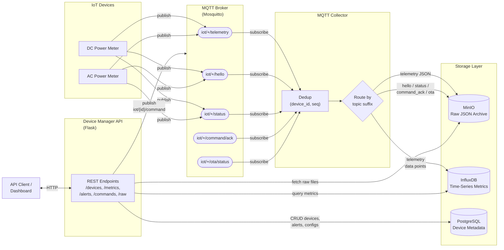
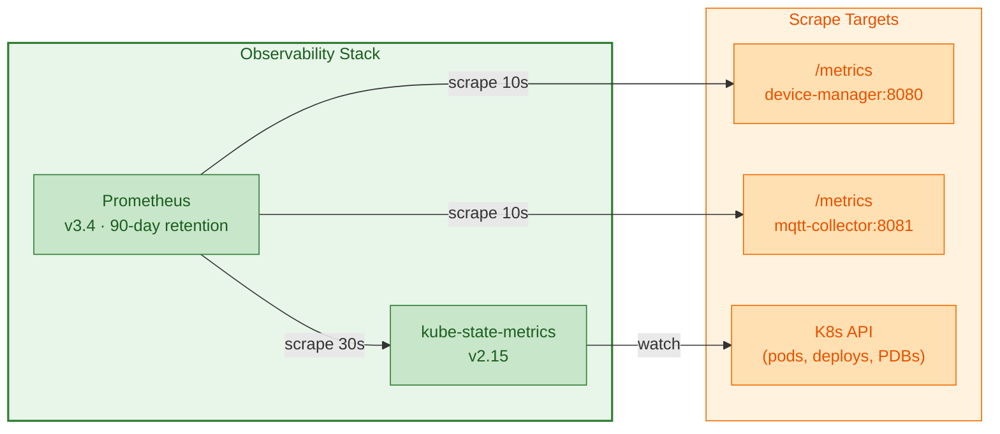

# IoT Meter - IoT Data Collection and Management System

A complete IoT architecture to collect, save, and process data in an IoT environment.

## Architecture Overview

This system implements a scalable IoT solution with the following components:

### Core Services

1. **MQTT Broker (Mosquitto)** - Message broker for IoT device communication
2. **MQTT Collector** - Service that subscribes to MQTT topics and forwards data
3. **MinIO** - S3-compatible object storage for raw data archival
4. **InfluxDB** - Time series database for metrics and analytics
5. **PostgreSQL** - Relational database for device metadata and management
6. **Device Manager API** - REST API for device management and data access
7. **IoT Device Simulator** - Simulates multiple IoT devices for testing

### Observability Services

8. **Prometheus** - Metrics collection, storage, and querying (90-day retention, OTLP receiver)
9. **kube-state-metrics** - Exports Kubernetes cluster state (pod crashes, deployment health, PDB status)

### Data Flow



### Observability Layer



## Quick Start

### Prerequisites

- Docker and Docker Compose installed
- At least 4GB of RAM available
- Ports 1883, 5432, 8080, 8086, 9000, 9090 available

### Starting the System

1. Clone the repository:
```bash
git clone https://github.com/lbartok/iot-meter.git
cd iot-meter
```

2. Start all services:
```bash
docker-compose up -d
```

3. Check service status:
```bash
docker-compose ps
```

4. View logs:
```bash
docker-compose logs -f
```

### Stopping the System

```bash
docker-compose down
```

To remove all data volumes:
```bash
docker-compose down -v
```

## Service Access

| Service | URL/Port | Credentials |
|---------|----------|-------------|
| Device Manager API | http://localhost:8080 | N/A |
| Prometheus UI | http://localhost:9091 | N/A |
| MinIO Console | http://localhost:9090 | minioadmin / minioadmin123 |
| InfluxDB UI | http://localhost:8086 | admin / adminpassword |
| PostgreSQL | localhost:5432 | iot_user / iot_password |
| MQTT Broker | localhost:1883 | Anonymous |

## API Documentation

### Device Management Endpoints

#### Get All Devices
```bash
curl http://localhost:8080/api/devices
```

Query parameters:
- `status`: Filter by status (active, inactive)
- `type`: Filter by device type

#### Get Single Device
```bash
curl http://localhost:8080/api/devices/device-001
```

#### Create Device
```bash
curl -X POST http://localhost:8080/api/devices \
  -H "Content-Type: application/json" \
  -d '{
    "device_id": "dc-meter-004",
    "device_name": "DC Traction Meter — Train 9000",
    "device_type": "power_meter_dc",
    "location": "Train 9000 / Car 1 / Main DC Bus",
    "status": "active",
    "metadata": {"voltage_system": "DC 750V", "accuracy_class": "0.5R"}
  }'
```

#### Update Device
```bash
curl -X PUT http://localhost:8080/api/devices/dc-meter-004 \
  -H "Content-Type: application/json" \
  -d '{
    "device_name": "Updated DC Meter",
    "location": "Train 9000 / Car 2"
  }'
```

#### Delete Device
```bash
curl -X DELETE http://localhost:8080/api/devices/dc-meter-004
```

#### Device Heartbeat
```bash
curl -X POST http://localhost:8080/api/devices/device-001/heartbeat
```

### Metrics Endpoints

#### Get Device Metrics
```bash
# Last hour of data
curl http://localhost:8080/api/devices/device-001/metrics

# Custom time range
curl "http://localhost:8080/api/devices/device-001/metrics?start=-24h&stop=now()"

# Specific metric
curl "http://localhost:8080/api/devices/device-001/metrics?metric=temperature"
```

#### Get Raw Data Files
```bash
curl http://localhost:8080/api/devices/device-001/raw-data
```

### Alert Endpoints

#### Get Device Alerts
```bash
curl http://localhost:8080/api/devices/device-001/alerts

# Only unacknowledged
curl "http://localhost:8080/api/devices/device-001/alerts?acknowledged=false"
```

#### Create Alert
```bash
curl -X POST http://localhost:8080/api/devices/device-001/alerts \
  -H "Content-Type: application/json" \
  -d '{
    "alert_type": "high_temperature",
    "severity": "warning",
    "message": "Temperature exceeded threshold"
  }'
```

#### Acknowledge Alert
```bash
curl -X POST http://localhost:8080/api/alerts/1/acknowledge
```

### Health & Readiness Endpoints

```bash
# Liveness probe
curl http://localhost:8080/healthz

# Readiness probe (checks DB + InfluxDB + MinIO)
curl http://localhost:8080/readyz
```

### Device Status & Commands

#### Get Device Status
```bash
curl http://localhost:8080/api/devices/dc-meter-001/status
```

#### Update Device Status
```bash
curl -X PUT http://localhost:8080/api/devices/dc-meter-001/status \
  -H "Content-Type: application/json" \
  -d '{"connection_status": "online"}'
```

#### Send Command to Device
```bash
curl -X POST http://localhost:8080/api/devices/dc-meter-001/commands \
  -H "Content-Type: application/json" \
  -d '{
    "cmd": "set_interval",
    "params": {"interval_s": 5}
  }'
```

#### Get Device Commands
```bash
curl http://localhost:8080/api/devices/dc-meter-001/commands
```

#### Acknowledge Command
```bash
curl -X PUT http://localhost:8080/api/commands/{cmd_id}/ack \
  -H "Content-Type: application/json" \
  -d '{"status": "accepted"}'
```

### Statistics Endpoint

```bash
curl http://localhost:8080/api/stats
```

## MQTT Topics

The system uses a v2 topic structure with five topic categories (see IoT.md §3.1):

```
iot/{device_id}/telemetry       # Measurement datagrams
iot/{device_id}/hello            # Heartbeat / hello messages
iot/{device_id}/status           # Online/offline (LWT)
iot/{device_id}/command/ack      # Command acknowledgements
iot/{device_id}/ota/status       # OTA progress reports
```

Example:
- `iot/dc-meter-001/telemetry`
- `iot/ac-meter-001/hello`

### Message Format

IoT devices publish v2 JSON datagrams in the following format:

```json
{
  "v": 2,
  "device_id": "dc-meter-001",
  "ts": "2026-02-12T16:00:00.000Z",
  "seq": 42,
  "msg_type": "telemetry",
  "measurements": [
    {"ts": "2026-02-12T16:00:00.000Z", "type": "voltage_dc", "val": 752.3, "unit": "V"},
    {"ts": "2026-02-12T16:00:00.000Z", "type": "current_dc", "val": 312.7, "unit": "A"}
  ]
}
```

## Testing with MQTT

### Publish a test message

```bash
docker exec -it iot-mosquitto mosquitto_pub \
  -t "iot/dc-meter-001/telemetry" \
  -m '{"v":2,"device_id":"dc-meter-001","ts":"2026-02-12T16:00:00.000Z","seq":1,"msg_type":"telemetry","measurements":[{"ts":"2026-02-12T16:00:00.000Z","type":"voltage_dc","val":752.3,"unit":"V"}]}'
```

### Subscribe to messages

```bash
docker exec -it iot-mosquitto mosquitto_sub \
  -t "iot/+/telemetry"
```

## Database Schema

### PostgreSQL Tables (5 tables)

#### devices
- `id`: Serial primary key
- `device_id`: Unique device identifier
- `device_name`: Human-readable name
- `device_type`: Type of device (`power_meter_dc`, `power_meter_ac`)
- `location`: Physical location
- `status`: Current status (active/inactive)
- `connection_status`: Online/offline/unknown (IoT.md §5)
- `last_seen`: Last heartbeat timestamp
- `fw_version`: Firmware version
- `created_at`: Creation timestamp
- `updated_at`: Last update timestamp
- `metadata`: JSONB metadata

#### device_configs
- Configuration key-value pairs for devices

#### device_alerts
- Alert history for devices

#### device_commands
- Server→device command queue with status tracking (IoT.md §6)
- Fields: `cmd_id` (UUID), `cmd`, `params` (JSONB), `status`, `ack_detail`, `acked_at`

#### device_seq_tracking
- Per-device sequence number tracking for deduplication (IoT.md §2.2)

## Data Storage

### MinIO (S3)

Raw data is stored in MinIO, partitioned by device and message category:
```
s3://iot-data/{device_id}/{category}/{timestamp}.json
```

Categories: `telemetry`, `hello`, `status`, `command_ack`, `ota_status`.

Access the MinIO console at http://localhost:9090 to browse files.

### InfluxDB

Time series metrics are stored in InfluxDB:
- Organization: `iot-org`
- Bucket: `iot-metrics`
- Measurement: `iot_telemetry`

Access the InfluxDB UI at http://localhost:8086 to query and visualize data.

## Monitoring and Observability

### Prometheus Metrics

Both application services expose a `/metrics` endpoint in the [Prometheus text exposition format](https://prometheus.io/docs/instrumenting/exposition_formats/).

| Service | Metrics URL | Scrape Interval |
|---------|------------|-----------------|
| Device Manager API | `http://localhost:8080/metrics` | 10 s |
| MQTT Collector | `http://localhost:8081/metrics` (health port) | 10 s |
| Prometheus self | `http://localhost:9091/metrics` | 15 s |

#### Device Manager Metrics

| Metric | Type | Description |
|--------|------|-------------|
| `http_request_duration_seconds_*` | Histogram | Auto-instrumented HTTP request latencies |
| `http_requests_total` | Counter | Auto-instrumented HTTP request count by method, status, handler |
| `device_manager_mqtt_commands_total` | Counter | MQTT commands published (labels: `cmd`, `status`) |
| `device_manager_influxdb_query_duration_seconds` | Histogram | InfluxDB Flux query latency |
| `device_manager_minio_list_duration_seconds` | Histogram | MinIO object listing latency |
| `device_manager_devices_total` | Gauge | Registered devices by status (refreshed on `/api/stats`) |
| `device_manager_alerts_unacknowledged` | Gauge | Unacknowledged alert count |
| `device_manager_info` | Info | Service version metadata |

#### MQTT Collector Metrics

| Metric | Type | Description |
|--------|------|-------------|
| `mqtt_collector_messages_received_total` | Counter | Messages received by topic suffix |
| `mqtt_collector_messages_processed_total` | Counter | Messages successfully processed |
| `mqtt_collector_messages_errors_total` | Counter | Processing errors by type (`json_decode`, `processing`, `minio_store`, `influxdb_write`) |
| `mqtt_collector_duplicates_dropped_total` | Counter | Duplicate messages dropped by dedup |
| `mqtt_collector_sequence_gaps_total` | Counter | Sequence number gaps detected |
| `mqtt_collector_minio_store_duration_seconds` | Histogram | MinIO put_object latency |
| `mqtt_collector_influxdb_write_duration_seconds` | Histogram | InfluxDB write latency |
| `mqtt_collector_mqtt_connected` | Gauge | MQTT broker connection state (1 = connected) |
| `mqtt_collector_minio_ready` | Gauge | MinIO readiness state |
| `mqtt_collector_influxdb_ready` | Gauge | InfluxDB readiness state |
| `mqtt_collector_devices_seen` | Gauge | Unique devices seen since startup |
| `mqtt_collector_info` | Info | Service version metadata |

#### kube-state-metrics (Kubernetes only)

In K8s deployments, [kube-state-metrics](https://github.com/kubernetes/kube-state-metrics) v2.15 exposes cluster state including:

- **Pod crash details**: `kube_pod_container_status_restarts_total`, `kube_pod_container_status_terminated_reason`
- **Deployment health**: `kube_deployment_status_replicas_available`, `kube_deployment_status_replicas_unavailable`
- **PDB status**: `kube_poddisruptionbudget_status_current_healthy`
- **Resource pressure**: `kube_pod_container_resource_requests`, `kube_pod_container_resource_limits`

### Prometheus Access

```bash
# Docker Compose — Prometheus UI
open http://localhost:9091

# Kubernetes — port-forward Prometheus
kubectl port-forward svc/prometheus 9091:9090 -n iot-meter
```

### Data Retention

Prometheus is configured with **90-day data retention** (`--storage.tsdb.retention.time=90d`).
This provides a rolling 3-month window of all endpoint latencies, error rates, message throughput,
and K8s pod health for post-incident analysis.

### OpenTelemetry

Prometheus v3.4+ includes a native **OTLP receiver** (`--web.enable-otlp-receiver`), enabled by default in this deployment. Applications or sidecars that speak OpenTelemetry Protocol can push metrics directly to Prometheus at `http://prometheus:9090/api/v1/otlp/v1/metrics`. The application services currently use the `prometheus_client` / `prometheus_flask_instrumentator` libraries for Prometheus-native instrumentation, which is the most battle-tested approach for Python + Flask. The OTLP receiver is available for future integration with OTel-instrumented services or distributed tracing exporters.

## Troubleshooting

### View service logs

```bash
# All services
docker-compose logs -f

# Specific service
docker-compose logs -f mqtt-collector
docker-compose logs -f device-manager
docker-compose logs -f iot-simulator
```

### Check service health

```bash
# Device Manager API
curl http://localhost:8080/health

# MinIO
curl http://localhost:9000/minio/health/live

# InfluxDB
curl http://localhost:8086/health
```

### Restart a service

```bash
docker-compose restart mqtt-collector
```

## Scaling Considerations

### Horizontal Scaling

1. **MQTT Collector**: Can run multiple instances with load balancing
2. **Device Manager API**: Can run multiple instances behind a load balancer
3. **IoT Simulators**: Can run multiple instances for load testing

### Production Recommendations

1. Use persistent volumes for data
2. Enable MQTT authentication and TLS
3. Set up proper backup strategies for databases
4. Implement monitoring and alerting
5. Use secrets management for credentials
6. Add rate limiting to the API
7. Implement message queue for high-volume scenarios

## Kubernetes Deployment

The project includes full Kubernetes manifests managed with [Kustomize](https://kustomize.io/).

### Prerequisites

- A running Kubernetes cluster (e.g. Docker Desktop, minikube, kind, or a cloud cluster)
- `kubectl` configured to talk to the cluster
- Docker available for building images

### Build Images

```bash
make k8s-build
```

This builds three images locally:

| Image | Source |
|-------|--------|
| `iot-meter/device-manager:latest` | `services/device-manager/` |
| `iot-meter/mqtt-collector:latest` | `services/mqtt-collector/` |
| `iot-meter/iot-device-simulator:latest` | `services/iot-device-simulator/` |

> **Tip:** If you use minikube, run `eval $(minikube docker-env)` before building so the images are available inside the VM.

### Deploy to Kubernetes

```bash
make k8s-deploy          # kubectl apply -k k8s/
```

All resources are created in the `iot-meter` namespace.

### Check Status

```bash
make k8s-status          # pods + services overview
kubectl get all -n iot-meter   # full resource listing
```

### Access the API (port-forward)

```bash
make k8s-port-forward    # forwards svc/device-manager → localhost:8080
```

Then use the API exactly as described in the [API Documentation](#api-documentation) section.

### View Logs

```bash
make k8s-logs-manager    # Device Manager logs
make k8s-logs-collector  # MQTT Collector logs
make k8s-logs-simulator  # IoT Simulator logs
```

### Tear Down

```bash
make k8s-delete          # kubectl delete -k k8s/
```

### One-liner: Build, Deploy & Smoke-test

```bash
./start.sh               # builds, deploys, waits for readiness, runs tests
```

> See [start.sh](start.sh) for the full bootstrap script.

---

## Testing

The project ships with a comprehensive test suite built on **pytest 8.3**.

### Test Categories

| Marker | What it covers | Infrastructure needed |
|--------|---------------|----------------------|
| `unit` | Individual functions & endpoints with mocks | None |
| `integration` | Cross-component interactions (mocked backends) | None |
| `e2e` | Full stack through MQTT & REST | Running cluster or Docker Compose |

### Install Test Dependencies

```bash
pip install -r requirements-test.txt
```

### Run Tests

```bash
# Unit tests only (fast, no infrastructure)
make test-unit

# Integration tests
make test-integration

# End-to-end tests (requires running services)
make test-e2e

# All tests at once
make test-all

# CI mode — unit + integration with coverage report
make test-ci
```

### Direct pytest Usage

```bash
# Run a specific test file
python -m pytest tests/unit/test_device_manager.py -v

# Run tests matching a keyword
python -m pytest tests/ -k "heartbeat" -v

# Run with coverage HTML report
python -m pytest tests/unit tests/integration --cov=services --cov-report=html
```

### Test Results

The latest test run produced the following results (162 tests):

```
tests/unit/test_device_manager.py    — 56 passed  (incl. 6 Prometheus /metrics tests)
tests/unit/test_mqtt_collector.py    — 37 passed  (incl. 6 Prometheus /metrics tests)
tests/unit/test_simulator.py         — 35 passed
tests/integration/test_integration.py — 10 passed
tests/e2e/test_e2e.py               — 20 tests (require running infrastructure)

Total: 138 passed (unit + integration), e2e requires running services
```

> E2E tests are skipped automatically when the target services are not reachable.

---

## Development

### Project Structure

```
iot-meter/
├── config/                     # Configuration files
│   ├── mosquitto.conf          # MQTT broker config
│   └── init-db.sql             # Database initialization
├── services/
│   ├── mqtt-collector/         # MQTT data collector
│   │   ├── collector.py
│   │   ├── requirements.txt
│   │   └── Dockerfile
│   ├── device-manager/         # REST API service
│   │   ├── app.py
│   │   ├── requirements.txt
│   │   └── Dockerfile
│   └── iot-device-simulator/   # Device simulator
│       ├── simulator.py
│       ├── requirements.txt
│       └── Dockerfile
├── k8s/                        # Kubernetes manifests (Kustomize)
│   ├── base/                   # Base manifests (local development)
│   │   ├── kustomization.yaml
│   │   ├── namespace.yaml
│   │   ├── configmap.yaml
│   │   ├── secrets.yaml
│   │   └── *.yaml              # Per-service deployments & services
│   └── overlays/
│       └── production/         # Production overlay (k3s)
│           ├── kustomization.yaml
│           ├── persistent-volumes.yaml
│           └── patches/        # Production-specific patches
├── tests/                      # Automated test suite
│   ├── conftest.py             # Shared fixtures
│   ├── unit/                   # Unit tests
│   ├── integration/            # Integration tests
│   └── e2e/                    # End-to-end tests
├── docker-compose.yml          # Local development orchestration
├── .github/workflows/deploy.yml # CI/CD pipeline (GitHub Actions)
├── start.sh                    # K8s bootstrap & test runner
├── IoT.md                      # IoT payload specification
├── assessment.md               # Improvement assessment
├── Makefile                    # Build / deploy / test targets
├── PRODUCTION.md               # Production deployment runbook
└── README.md                   # This file
```

### Adding New Device Types

1. Update the simulator in `services/iot-device-simulator/simulator.py`
2. Add device type handling in the `generate_sample()` method
3. Update device creation in PostgreSQL

### Customizing the Collector

Edit `services/mqtt-collector/collector.py` to:
- Add data validation
- Implement filtering logic
- Add data transformation
- Integrate additional storage backends

## Security Notes

⚠️ **Important**: The default configuration uses simple passwords and no encryption. For production use:

1. Change all default passwords
2. Enable TLS for MQTT
3. Use proper authentication for all services
4. Implement API authentication and authorization
5. Use environment variables or secrets management for credentials
6. Enable network encryption between services

## Production Deployment

The platform can be deployed to a production server using **k3s** (lightweight Kubernetes)
with CI/CD via **GitHub Actions**.

### Architecture

- **k3s** single-node cluster (expandable to multi-node)
- **GitHub Actions** self-hosted runner for CI/CD
- **NPM** (Nginx Proxy Manager) for HTTPS / Let's Encrypt
- **ZFS** for persistent data storage with snapshots

### CI/CD Pipeline

The pipeline runs on every push to `main` with three stages:

1. **Build** — Build Docker images for all services
2. **Test** — Run unit & integration tests (deployment blocked if tests fail)
3. **Deploy** — Apply K8s production overlay, inject secrets, verify health

The IoT device simulator can be toggled on/off via the `DEPLOY_SIMULATOR` GitHub
Actions variable, or through the manual workflow dispatch UI.

### Quick Reference

| Resource | URL / Port |
|----------|------------|
| REST API | `https://iot.bartok.sk` |
| MQTT     | `iot.bartok.sk:1883` (plain TCP) |
| Health   | `https://iot.bartok.sk/healthz` |

### Getting Started

See **[PRODUCTION.md](PRODUCTION.md)** for the complete server setup runbook covering:

- Server preparation and user creation
- Docker CE and k3s installation
- ZFS data directory setup
- GitHub Actions runner installation
- Firewall, DNS, and NPM configuration
- GitHub Secrets setup
- Backup strategy and monitoring
- Multi-node expansion path

## License

MIT License - See LICENSE file for details

## Support

For issues and questions, please open an issue on GitHub. 
